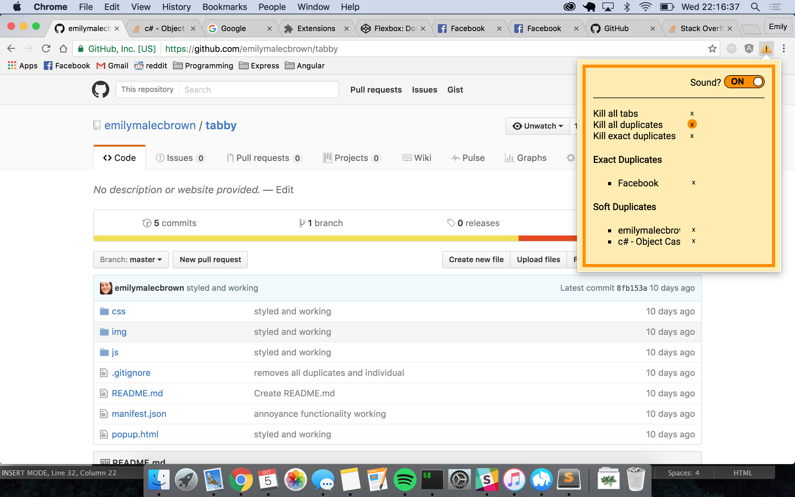
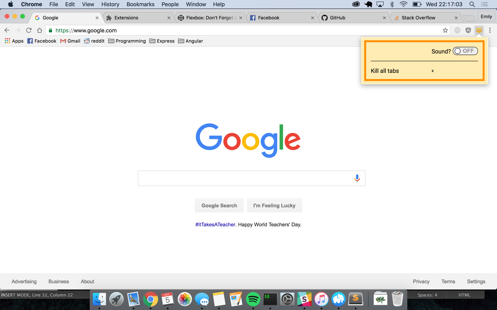

# tabby

A simple Chrome extension to reign in those with bad tabits.

This Chrome extension keeps track of your exact (same url), and soft (same hostname) tab duplicates and give you the ability to quickly close them.

Display popup

Features
- Close all tabs
- Close duplicates
- Alert icon when you have too many tabs (>7 now)
- Alert noise when you have too many tabs (>7 now)

Technology
- JavaScript, AngularJS, Node.js, and Chrome.* APIs

To be implemented
- Turning off alert noise
- Choosing when you would like alerts (in number of tabs)
- Bug fixes
